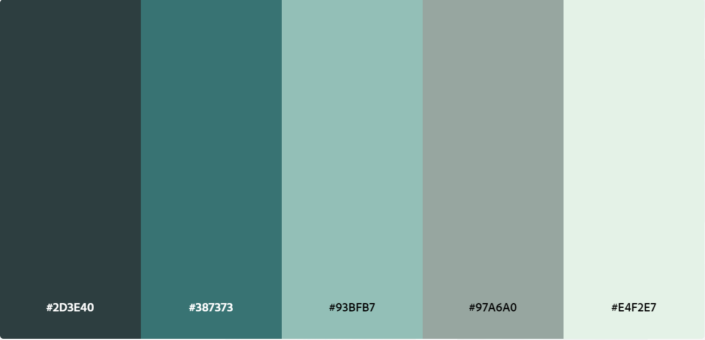
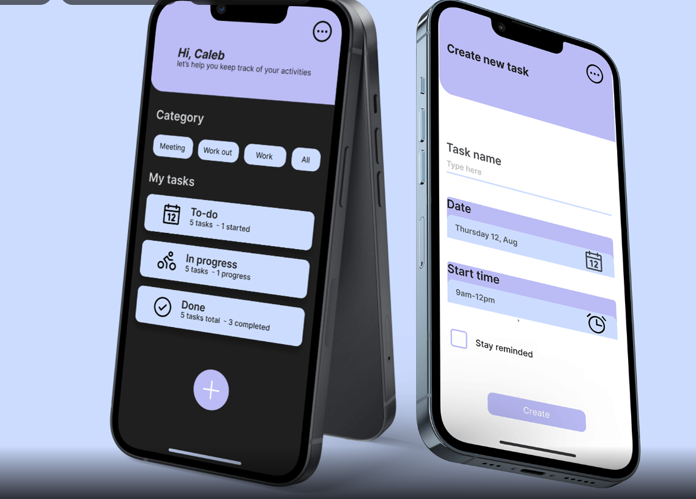
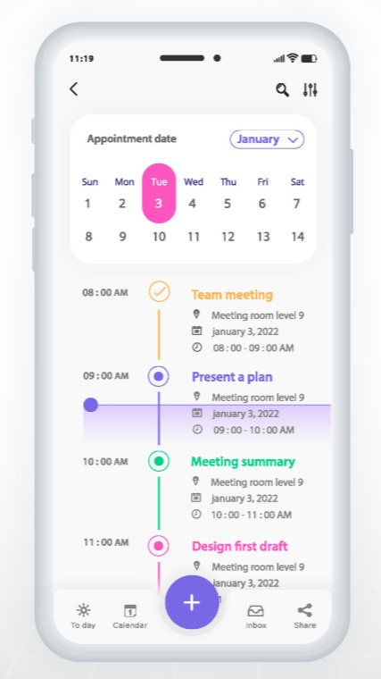

# Planejamento de Requisitos para Aplicação

## 1. Objetivo da Aplicação

Um aplicativo que ajuda as pessoas a gerenciar o tempo e priorizar tarefas entre outras atividades de forma eficaz usando a inteligência artificial como base. Além disso, existirá um ChatBOT para que ajude o usuário em sua mentalidade financeira e emocional. O usuário coloca seus dados e preferências no aplicativo e sugere melhorias para otimizar o uso do tempo, evitando procrastinação. Também sugere intervalos de descanso, técnicas de produtividade, como Pomodoro, e ajuda a criar um equilíbrio entre trabalho e lazer para ajudar em sua saúde mental.

No fluxo de uso do programa o usuário faria um cadastro e logo após poderia escolher suas preferências e gostos pessoais, logo em seguida já seriam dadas sugestões “iniciais” para o usuario aprovar ou não reprovar. além disso existirá uma aba com que o usuário falará com o ChatBOT personalizado para ajuda-lo em suas questões pessoais.

---

## 2. Funcionalidades Principais

- **Autenticação**:
    - Cadastro de usuários.
    - Login e Logout.
    - Recuperação de senha.

- **Funcionalidades para Usuários**:
    - Editar perfil e preferências.
    - Aceitar ou Recusar sugestôes geradas.
    - Agenda com to-do list.

 - **Administração**:
    - Adicionar Prompt 
    - Gerenciar Usuarios
    - Suporte Técnico

---

## 3. Requisitos Não Funcionais

- **Performance**:
    - Tempo de resposta, as sugestões geradas pela IA devem ser rápidas, com um tempo de resposta inferior a 2 segundos após o envio do usuario.
    - Eficiência no uso de recursos, o aplicativo deve ser leve, consumindo o mínimo de memória ram em dispositivos móveis, para garantir que não afete negativamente outras funções do dispositivo.
    - Escalabilidade, a arquitetura do sistema deve ser capaz de escalar para suportar um grande número de usuários simultâneos, utilizando servidores em nuvem para processar grandes volumes de dados.

- **Segurança**: 
    - Criptografia de senhas.
    - Controle de acesso seguro para usuários e administradores.
    - Proteção contra ataques comuns (ex.: SQL Injection, XSS).
    - Política de privacidade, garantir que os dados dos usuários não sejam compartilhados com terceiros sem consentimento explícito.

- **Compatibilidade**:
    - Compativel para dispositivos móveis (Androids E IoS)

---

## 4. Requisitos Técnicos
    
- **Frontend**:
    - Framework: React Native ou Ionic
    - Biblioteca de componentes: Material UI ou Bootstrap.
    - Responsividade: CSS Grid/Flexbox.

- **Backend**:
    - Linguagem: Node.js com Express.js.
    - APIs: REST (ou GraphQL).

- **Banco de Dados**:
    - Tipo: Relacional (MySQL ou PostgreSQL).
    - Estrutura: Tabelas ou coleções para usuários, sugestões, etc.

- **Hospedagem e Infraestrutura**:

---

## 6. Modelo de Dados

Para o desenvolvimento de um aplicativo que auxilia na gestão do tempo, produtividade e saúde mental, integrando inteligência artificial (IA) e um ChatBOT para suporte emocional e financeiro, o modelo de dados precisa refletir a complexidade das interações com o usuário, preferências pessoais, sugestões da IA e interações com o ChatBOT. Abaixo está uma proposta de estrutura do banco de dados para este projeto.

### Modelo de Dados

#### 1. **Usuários**
Tabela para armazenar informações básicas sobre os usuários, suas credenciais de login e dados pessoais relevantes para o funcionamento do sistema.

| Campo               | Tipo           | Descrição                                       |
|---------------------|----------------|-------------------------------------------------|
| `user_id`           | INT (PK)       | Identificador único do usuário                  |
| `name`              | VARCHAR(100)   | Nome do usuário                                 |
| `email`             | VARCHAR(100)   | E-mail do usuário                               |
| `password`          | VARCHAR(255)   | Senha hashada                                   |
| `date_of_birth`     | DATE           | Data de nascimento do usuário                   |
| `created_at`        | TIMESTAMP      | Data de criação da conta                        |

#### 2. **Preferências de Usuário**
Tabela para armazenar as preferências de cada usuário, incluindo seus horários preferidos de trabalho, intervalos de descanso e técnicas de produtividade.

| Campo               | Tipo           | Descrição                                       |
|---------------------|----------------|-------------------------------------------------|
| `preference_id`     | INT (PK)       | Identificador único da preferência              |
| `user_id`           | INT (FK)       | Referência ao usuário                           |
| `work_hours_start`  | TIME           | Horário preferido de início de trabalho         |
| `work_hours_end`    | TIME           | Horário preferido de término de trabalho        |
| `break_interval`    | INT            | Intervalo de descanso (em minutos)              |
| `technique`         | VARCHAR(50)    | Técnica de produtividade preferida (ex: Pomodoro) |
| `rest_days`         | VARCHAR(50)    | Dias de descanso preferidos (ex: "Sábado, Domingo") |
| `created_at`        | TIMESTAMP      | Data de criação da preferência                  |

#### 3. **Sugestões de Produtividade**
Tabela que armazena sugestões geradas pela IA com base nas preferências do usuário. As sugestões podem incluir mudanças no horário de trabalho, pausas e técnicas de produtividade.

| Campo               | Tipo           | Descrição                                       |
|---------------------|----------------|-------------------------------------------------|
| `suggestion_id`     | INT (PK)       | Identificador único da sugestão                 |
| `user_id`           | INT (FK)       | Referência ao usuário                           |
| `suggestion_text`   | TEXT           | Descrição da sugestão                           |
| `status`            | ENUM ('Aprovado', 'Reprovado', 'Pendente') | Status da sugestão pelo usuário                 |
| `created_at`        | TIMESTAMP      | Data de criação da sugestão                     |

#### 4. **Tarefas**
Tabela para gerenciar as tarefas dos usuários, permitindo a organização e priorização das atividades.

| Campo               | Tipo           | Descrição                                       |
|---------------------|----------------|-------------------------------------------------|
| `task_id`           | INT (PK)       | Identificador único da tarefa                   |
| `user_id`           | INT (FK)       | Referência ao usuário                           |
| `task_title`        | VARCHAR(255)   | Título da tarefa                                |
| `task_description`  | TEXT           | Descrição da tarefa                             |
| `due_date`          | DATE           | Data de conclusão esperada                      |
| `priority`          | ENUM ('Alta', 'Média', 'Baixa') | Prioridade da tarefa                           |
| `status`            | ENUM ('Pendente', 'Concluída', 'Cancelada') | Status da tarefa                               |
| `created_at`        | TIMESTAMP      | Data de criação da tarefa                       |

#### 5. **Histórico de Tarefas**
Tabela que registra o histórico de alterações nas tarefas, útil para auditoria e acompanhamento de produtividade.

| Campo               | Tipo           | Descrição                                       |
|---------------------|----------------|-------------------------------------------------|
| `history_id`        | INT (PK)       | Identificador único do histórico                |
| `task_id`           | INT (FK)       | Referência à tarefa                             |
| `user_id`           | INT (FK)       | Referência ao usuário                           |
| `change`            | TEXT           | Descrição da alteração                          |
| `changed_at`        | TIMESTAMP      | Data da alteração                               |

#### 6. **Interações com o ChatBOT**
Tabela que registra as interações entre o usuário e o ChatBOT, incluindo consultas emocionais ou financeiras e as respostas geradas.

| Campo               | Tipo           | Descrição                                       |
|---------------------|----------------|-------------------------------------------------|
| `interaction_id`    | INT (PK)       | Identificador único da interação                |
| `user_id`           | INT (FK)       | Referência ao usuário                           |
| `message_text`      | TEXT           | Mensagem enviada pelo usuário                   |
| `bot_response`      | TEXT           | Resposta gerada pelo ChatBOT                    |
| `interaction_type`  | ENUM ('Financeiro', 'Emocional') | Tipo de interação (financeira ou emocional)    |
| `created_at`        | TIMESTAMP      | Data da interação                               |

#### 7. **Agenda de Atividades**
Tabela para organizar a agenda pessoal do usuário, registrando eventos e compromissos importantes.

| Campo               | Tipo           | Descrição                                       |
|---------------------|----------------|-------------------------------------------------|
| `event_id`          | INT (PK)       | Identificador único do evento                   |
| `user_id`           | INT (FK)       | Referência ao usuário                           |
| `event_title`       | VARCHAR(255)   | Título do evento                                |
| `event_date`        | DATE           | Data do evento                                  |
| `event_time`        | TIME           | Horário do evento                               |
| `location`          | VARCHAR(255)   | Localização do evento                           |
| `created_at`        | TIMESTAMP      | Data de criação do evento                       |

#### 8. **Relatórios de Produtividade**
Tabela que registra relatórios periódicos sobre o desempenho do usuário, com base nas suas tarefas e interações no sistema.

| Campo               | Tipo           | Descrição                                       |
|---------------------|----------------|-------------------------------------------------|
| `report_id`         | INT (PK)       | Identificador único do relatório                |
| `user_id`           | INT (FK)       | Referência ao usuário                           |
| `productivity_score`| DECIMAL(5,2)   | Pontuação de produtividade calculada pela IA    |
| `suggestions_given` | TEXT           | Sugestões fornecidas ao usuário no relatório    |
| `created_at`        | TIMESTAMP      | Data de geração do relatório                    |

### Relacionamentos
- **Usuário-Preferências**: Um usuário pode ter várias preferências personalizadas ao longo do tempo.
- **Usuário-Sugestões de Produtividade**: A IA fornece várias sugestões para cada usuário, que são avaliadas.
- **Usuário-Tarefas**: Cada usuário pode criar várias tarefas, organizadas com base em sua prioridade e status.
- **Usuário-ChatBOT**: As interações entre o usuário e o ChatBOT são registradas, diferenciadas por tipo (emocional ou financeiro).
- **Usuário-Agenda**: Cada usuário pode ter vários eventos e compromissos agendados.
- **Usuário-Relatórios**: Relatórios de produtividade são gerados com base nas atividades e interações do usuário.

---

## 7. Protótipos Visuais

- **Cores**: 

Este tema de cores consiste em Liquorice Green, Jungle Noises, Envisage, Farmers Green e Polar. 

- **Referencia para interface**:

Uma interface mais clean e de facil entendimento onde o usuario não fique confuso ou perdido em meio as funcionalidades.

- **Referencia para funcionalidades**:

  

  O usuario teria sugestões para aceitar ou recusar

  

  O usuario teria acesso a um calendario para colocar seus horarios disponiveis e seus horarios onde estão em atividade.

- **Funcionalidades para Usuarios**:
    - Notificações push 
    - Histórico de tarefas concluídas e sugestões aceitas
    - Relatórios semanais 
    - Preferencias do Usuario

--- 

## 8. Cronograma de Desenvolvimento

| Fase                       |Descrição                                   | Tempo Estimado       |
|----------------------------|--------------------------------------------|----------------------|
| Planejamento               | Definição de requisitos e arquitetura      | 2 semanas            |
| Desenvolvimento do Backend | Implementação das APIs e banco de dados    | 3 semanas            |
| Desenvolvimento do Frontend| Implementação do frontend e integração     | 3 semanas            |
| Testes                     | Testes funcionais e ajustes                | 2 semanas            |
| Implantação                | Deploy da aplicação em ambiente de produção| 2 semanas            |

---

## 9. Equipe
Liste as pessoas responsáveis por cada área do projeto.

- **Gestor de Projeto**: Gustavo Ribeiro
- **Gestor de Técnico**: Adrian Feijó
- **Desenvolvedor Backend**: Adrian Feijó
- **Desenvolvedor Frontend**: Gustavo Ribeiro, Emanuel Chaves
- **Designer UX/UI**: Maria Eduarda.

---

## 11. Considerações Finais
Para a integração da IA pensar na possibilidade de usar o **TensorFlow.js** para modelos de IA que podem ser executados no próprio dispositivo do usuário ou no servidor além disso pensar em uma **análise preditiva** um sistema de IA que analisa o histórico de uso do aplicativo para sugerir melhorias específicas com base nos hábitos e preferências de cada usuário.

---
