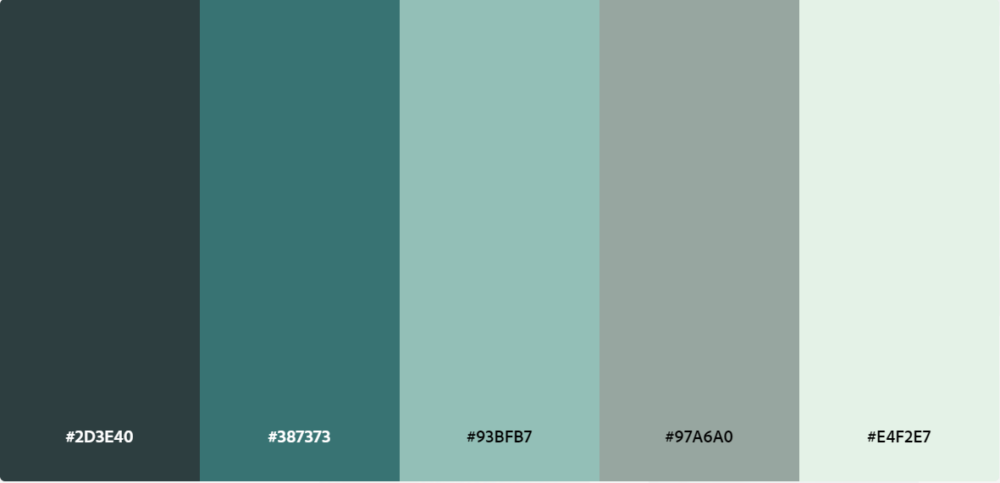
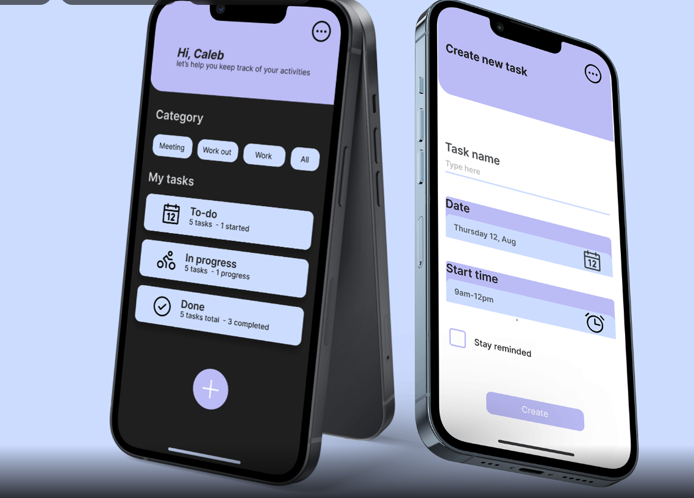
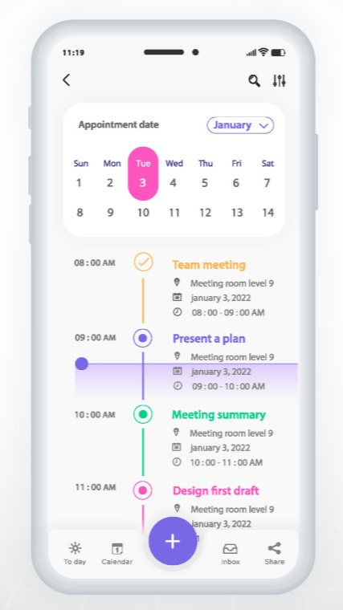

# Planejamento de Requisitos para Aplicação

## 1. Objetivo da Aplicação

Um aplicativo que ajuda as pessoas a gerenciar o tempo e priorizar tarefas entre outras atividades de forma eficaz usando a inteligência artificial como base. O usuário coloca seus dados e preferências no aplicativo e sugere melhorias para otimizar o uso do tempo, evitando procrastinação. Também sugere intervalos de descanso, técnicas de produtividade, como Pomodoro, e ajuda a criar um equilíbrio entre trabalho e lazer.

No fluxo de uso do programa o usuário faria um cadastro e logo após poderia escolher suas preferências e gostos pessoais, logo em seguida já seriam dadas sugestões “iniciais” e a pessoa aprovaria ou não a sugestão.

---

## 2. Funcionalidades Principais

- **Autenticação**:
    - Cadastro de usuários.
    - Login e Logout.
    - Recuperação de senha.

- **Funcionalidades para Usuários**:
    - Editar perfil e preferências.
    - Aceitar ou Recusar sugestôes geradas.
    - Agenda com to-do list.

 - **Administração**:
    - Adicionar Prompt 
    - Gerenciar Usuarios
    - Suporte Técnico

---

## 3. Requisitos Não Funcionais

- **Performance**:
    - Tempo de resposta, as sugestões geradas pela IA devem ser rápidas, com um tempo de resposta inferior a 2 segundos após o envio do usuario.
    - Eficiência no uso de recursos, o aplicativo deve ser leve, consumindo o mínimo de memória ram em dispositivos móveis, para garantir que não afete negativamente outras funções do dispositivo.
    - Escalabilidade, a arquitetura do sistema deve ser capaz de escalar para suportar um grande número de usuários simultâneos, utilizando servidores em nuvem para processar grandes volumes de dados.

- **Segurança**: 
    - Criptografia de senhas.
    - Controle de acesso seguro para usuários e administradores.
    - Proteção contra ataques comuns (ex.: SQL Injection, XSS).
    - Política de privacidade, garantir que os dados dos usuários não sejam compartilhados com terceiros sem consentimento explícito.

- **Compatibilidade**:
    - Compativel para dispositivos móveis (Androids E IoS)

---

## 4. Requisitos Técnicos
    
- **Frontend**:
    - Framework: React Native ou Ionic
    - Biblioteca de componentes: Material UI ou Bootstrap.
    - Responsividade: CSS Grid/Flexbox.

- **Backend**:
    - Linguagem: Node.js com Express.js.
    - APIs: REST (ou GraphQL).

- **Banco de Dados**:
    - Tipo: Relacional (MySQL ou PostgreSQL).
    - Estrutura: Tabelas ou coleções para usuários, sugestões, etc.

- **Hospedagem e Infraestrutura**:

---

## 6. Modelo de Dados

### Exemplo: Tabela de Usuários

| Campo      | Tipo       | Descrição                            |
|------------|------------|--------------------------------------|
| id         | INT        | Identificador único do usuário       |
| nome       | VARCHAR(50)| Nome do usuário                      |
| email      | VARCHAR(100)| Email do usuário                    |
| senha      | VARCHAR(255)| Senha criptografada                 |
| criado_em  | DATETIME   | Data de criação do usuário           |

### Exemplo: Tabela de Preferências

| Campo      | Tipo       | Descrição                            |
|------------|------------|--------------------------------------|
| id         | INT        | Identificador único do usuário       |
| pref          | VARCHAR(255)| Nome da preferencia                |
| horarioInicio | TIME        | Inicio da atividade                |
| horarioFim    | TIME        | Fim da atividade                   |
| intervalo     | TIME        | duraçao do intervalo               |
| metodo_prod   | VARCHAR(255)| Metodo que vai ser utilizado       |

### Exemplo: Tabela Preferências de usuário

| Campo         | Tipo        | Descrição                          |
|---------------|-------------|------------------------------------|
| id            | INT         | Identificador único                |
| id_pref       | INT         | Chave Estrangeira preferências     |
| id_user       | INT         | Chave Estrangeira usuários         |

### Exemplo: Agenda

| Campo         | Tipo        | Descrição                          |
|---------------|-------------|------------------------------------|
| id            | INT         | Identificador único                |
| data          | DATE        | Define uma data para tarefa        |
| horarios      | TIME        | Define um horário para tarefa      |
| titulo_tarefa | VARCHAR(100)| Titulo da tarefa                   |
| tarefas       | TEXT        | A tarefa em propriamente dita      |

### Exemplo: Segestões de Produtividade

| Campo         | Tipo        | Descrição                          |
|---------------|-------------|------------------------------------|
| id            | INT         | Identificador único                |
| id_user       | INT         | Chave estrangeira usuário          |
| sugestao      | TEXT        | Texto da sugestão de hábito/tarefa |
| sugestao_at   | TIMESTAMP   | Data de criação da sugestão        |
| implementacao_at| TIMESTAMP | Data de implementaçao da sugestão  |

### Exemplo: Prompt IA

| Campo         | Tipo        | Descrição                          |
|---------------|-------------|------------------------------------|
| id            | INT         | Identificador único                |
| prompt        | TEXT        | Prompt para utilizar na IA         |

---

## 7. Protótipos Visuais

- **Cores**: 

Este tema de cores consiste em Liquorice Green, Jungle Noises, Envisage, Farmers Green e Polar. 

- **Referencia para interface**:

Uma interface mais clean e de facil entendimento onde o usuario não fique confuso ou perdido em meio as funcionalidades.

- **Referencia para funcionalidades**:

  

  O usuario teria sugestões para aceitar ou recusar

  

  O usuario teria acesso a um calendario para colocar seus horarios disponiveis e seus horarios onde estão em atividade.

- **Funcionalidades para Usuarios**:
    - Notificações push 
    - Histórico de tarefas concluídas e sugestões aceitas
    - Relatórios semanais 
    - Preferencias do Usuario

--- 

## 8. Cronograma de Desenvolvimento

| Fase                       |Descrição                                   | Tempo Estimado       |
|----------------------------|--------------------------------------------|----------------------|
| Planejamento               | Definição de requisitos e arquitetura      | 2 semanas            |
| Desenvolvimento do Backend | Implementação das APIs e banco de dados    | 3 semanas            |
| Desenvolvimento do Frontend| Implementação do frontend e integração     | 3 semanas            |
| Testes                     | Testes funcionais e ajustes                | 2 semanas            |
| Implantação                | Deploy da aplicação em ambiente de produção| 2 semanas            |

---

## 9. Equipe
Liste as pessoas responsáveis por cada área do projeto.

- **Gestor de Projeto**: Gustavo Ribeiro
- **Gestor de Técnico**: Adrian Fagundes
- **Desenvolvedor Backend**: Guilherme Keller, Adrian Fagundes
- **Desenvolvedor Frontend**: Gustavo Ribeiro, Emanuel Chaves
- **Designer UX/UI**: Maria Eduarda.

---

## 11. Considerações Finais
Para a integração da IA pensar na possibilidade de usar o **TensorFlow.js** para modelos de IA que podem ser executados no próprio dispositivo do usuário ou no servidor além disso pensar em uma **análise preditiva** um sistema de IA que analisa o histórico de uso do aplicativo para sugerir melhorias específicas com base nos hábitos e preferências de cada usuário.

---
